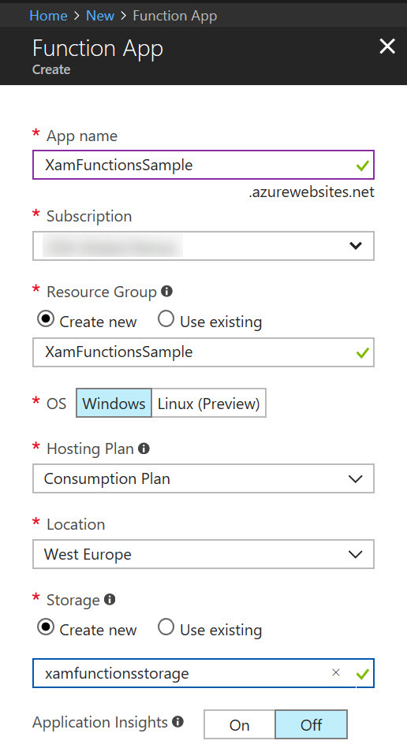
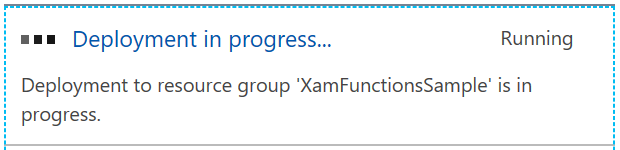
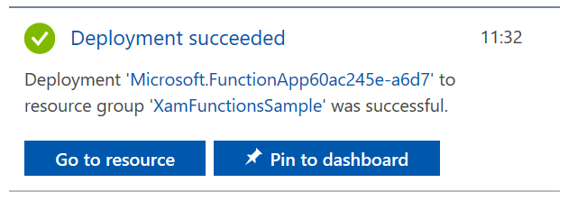

# Creating the Azure Function in the Azure Web Portal

In this section, we will build the Azure Functions application and then add an HTTP Triggered function. This will allow us to call the function from the Xamarin client, for example with an [HttpClient](https://developer.xamarin.com/api/type/System.Net.Http.HttpClient/) instance.

To create the Azure Functions application, follow the steps:

1. Log into the [Azure Portal](http://portal.azure.com) with your user account.

> Note: You will need an Azure account to create this sample. If you don't have one already, [you can get a free trial account here](http://azure.microsoft.com/free/).

2. Click the "Create a resource" menu item.

3. In the Azure Marketplace, select the "Serverless Function App" choice.

4. Fill the form with the following data:

    - App Name: This is a unique name for your application. One application can contain multiple functions.

    - Subscription: The subscription to which these functions will be billed. In some cases you will only see one subscription here but some people have multiple subcriptions associated to their account.

    - Resource group: This is a logical grouping of Azure resources. It makes sense to have one resource group per application, so you can easily locate the resources that you are using. In this case we are creating a new resource group for this application.

    -  OS: The operating system of the server on which the functions will run.

    - Hosting plan: This shows how the function usage will be billed.
        - Consumption plan means that the function will be billed whenever it is called, and only for the time that it runs. This is the best plan to get started.
        - Aop Service Plan is best after your business starts attracting more users and you need some more predictable billing.

    - Location will be the physical location of the server on which your functions will run. You should choose a server close to your users.

    - Storage: You can either create a new storage account, or use an existing one. Note that this sample doesn't use storage but you still need to specify a storage account.

    > Note: The storage account name should be entered in lower caps.

    - Application Insights: If you want to add extra analytics on your functions application, you can switch this off. This provides you with stats about the usage, crash reports, custom events, etc. In this sample we will not use Application Insights.

5. Click the Create button. This will trigger the deployment, and you should see a popup like shown below.

6. After a moment wait, you should see a new notification: Deployment succeeded. You can then click the button to go to the resource, or simply close the notification.

> Note: You can always go back to the application by clicking on the Function Apps menu item on the left hand side.

7. Once you are in the Functions application in the portal, expand the application itself. Next to the "Functions" submenu, you will see a "+" sign when you hover over the submenu.

8. Now we need to choose what will *trigger* the function that we will create. There are a large number of triggers available and we cannot review all of them here. You can find some examples of 