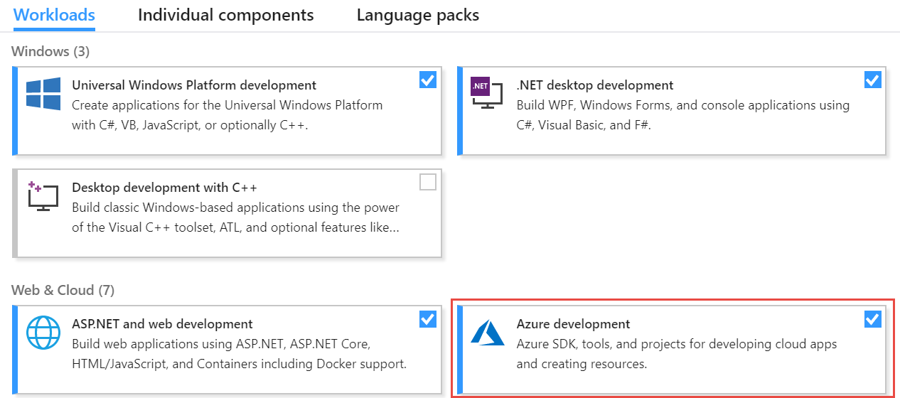
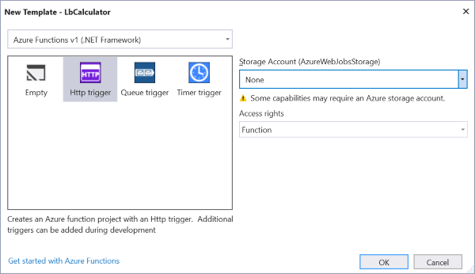

# Creating the Azure Function in Visual Studio

The great thing with the Azure tooling is that you can decide what tools you are more comfortable with. You can decide to [create the function in the Azure web portal](./creating.md), or you can take advantage of Visual Studio and its complete suite of tools, including unit testing, performance analysis, local debugging etc. In this section, we will show how the function can be created in Visual Studio, how to run the function locally to test it and how to publish it to Azure.

## Creating the function application

To create the function application in Visual Studio, you will need Visual Studio 2017. You can perform these steps in any version of Studio, [including the free Community edition](TODO_LINK). In the installer, make sure that the Azure development workload is installed.



1. Start Visual Studio 2017.

2. Select File, New, Project from the menu bar.

3. In the New Project dialog, select the Cloud category and then Azure Functions. 

4. Enter a name for the Function application. Note that you can have multiple functions in one Function application. Then press OK.

> Note: The function's name should be unique and will appear in the function's URL. For example if the function is named LbCalculator, the domain will be https://lbcalculator.azurewebsites.net.

5. In the New Template dialog, select Http trigger and the following options:

    - Azure Functions v1 (.NET framework). If you prefer, you can also select Azure Functions v2 (.NET core). The advantage of a .NET core function application is that it can run on servers with Linux. However some features are unavailable at this point.
    - Under Storage Account, select None. This particular sample doesn't require storage. However if your function needs data, tables etc, you may want to connect it to an Azure Storage account.
    - Set Access rights to Function.



When the function application is created, it gives the default name "Function1" to the function. This is a little unfortunate because you will need to rename it to something more meaningful.

5. Rename the ```Function1.cs``` file to ```Add.cs```.

6. Open the ```Add.cs``` file in the code editor and modify the code as shown here:

```CS
public static class Add
{
    [FunctionName("Add")]
    public static async Task<HttpResponseMessage> Run(
        [HttpTrigger(
            AuthorizationLevel.Function, 
            "get",
            Route = "add/num1/{num1}/num2/{num2}")]
        HttpRequestMessage req, 
        int num1,
        int num2,
        TraceWriter log)
    {
        log.Info($"C# HTTP trigger function processed a request with {num1} and {num2}");

        var addition = num1 + num2;

        // Fetching the name from the path parameter in the request URL
        return req.CreateResponse(HttpStatusCode.OK, addition);
    }
}
```

There are a few interesting things about the code above:

- We changed the ```Run``` method's signature. The Azure runtime will use this information to configure the service. First, we removed the ```"post"``` method because we want this function to only accept ```get``` methods. Then we modified the ```Route``` parameter of the ```HttpTrigger``` attribute. We declare the new route to be ```"add/num1/{num1}/num2/{num2}"```. In the client code, when we call the URL, we will replace ```{num1}``` with the first operand of the addition, and ```{num2}``` with the second operand.

- We declare two parameters named ```num1``` and ```num2``` of type ```int```. Conveniently, the Azure runtime will automatically convert the ```{num1}``` and ```{num2}``` parts of the URL into the corresponding integers.

- We log an entry when the function is called. You can see the log entry in the debug window later, or in the Azure web portal. Logging can be very useful to debug some difficult issues.

- We then execute the addition with the two operands and return the result thanks to a call to the ```CreateResponse``` method.

> Note: since HTTP is a text-based protocol, the result of the addition will be returned to the client as text. Later we will see how modern APIs use the JavaScript Object Notation (JSON) to encode API inputs and outputs. JSON can easily be serialized and deserialized.

## Testing the function

One of he greatest advantages of Visual Studio over the Azure web portal for function creation and implementation is that you can run the function locallu, which is very convenient for test purposes.

1. 