# Implementing the first version of the Xamarin.Forms client app

We know that our function works well now, because we tested it [in the Azure Portal](./implementing.md#testing-the-new-signature) and [in Visual Studio 2017](./creating-vs.md#testing-the-function). Now we will build a Xamarin.Forms client app that runs on iOS, Android and Windows to use this new function.

In the previous step, we copied the function's URL for later usage. Make sure to keep this URL handy, we will need it later in the client's code.

- [Copying the URL when creating the Function in the Azure Portal](./implementing.md#getting-the-url-for-the-xamarin-client)
- [Copying the URL when creating the Function in Visual Studio 2017](./creating-vs.md#getting-the-url-for-the-xamarin-client-app)

1. In Visual Studio 2017, select File > New > Project.

> Note: We use Visual Studio 2017 on Windows for this sample, but you can also create Xamarin.Forms applications in Visual Studio for Mac if you prefer. Xamarin is available for free in all editions of Visual Studio, including the free Community edition, on PC and Mac.
> - [Visual Studio Community Edition for Windows](http://gslb.ch/a72)
> - [Visual Studio for Mac](http://gslb.ch/a73)

2. In the New Project dialog, select the Cross-Platform category, and then Cross-Platform App (Xamarin.Forms) with Visual C#. Name the new application ```XamCalculator```, select a location for the project and press OK.

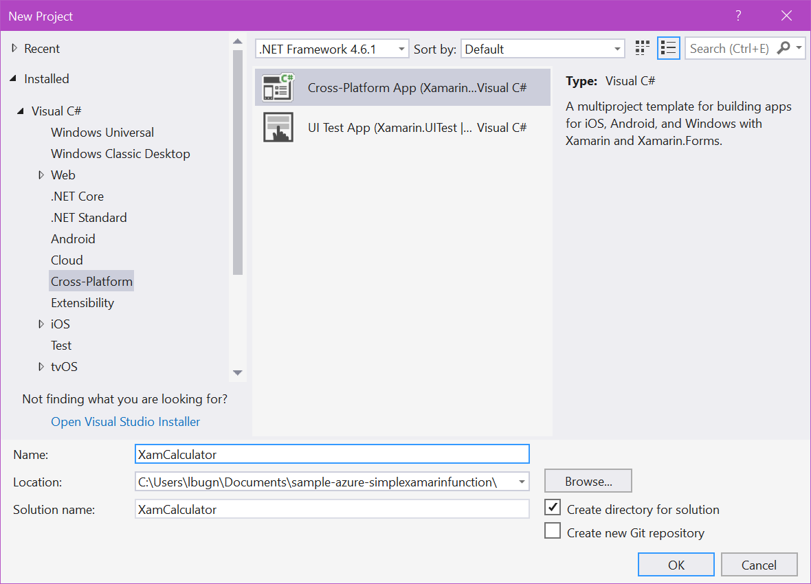

> Note: The Cross-platform category is available if you selected the "Mobile development with .NET" workload in the Visual Studio 2017 installer.

3. In the New Cross Platform App dialog, select the following settings, then press OK.
    - Android, iOS and Windows
    - Xamarin.Forms
    - .NET Standard

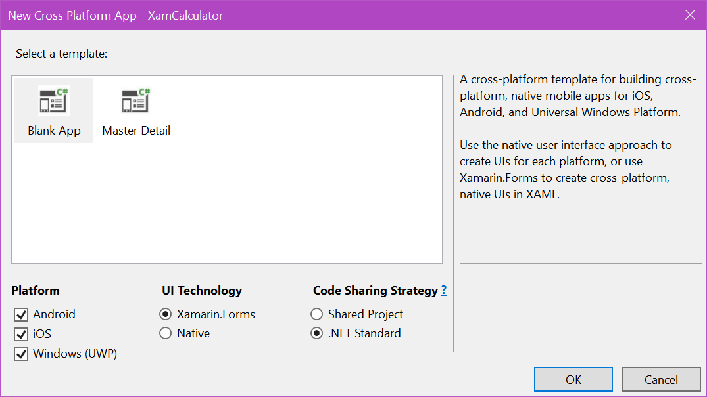

The new application consists of 4 projects:

- XamCalculator: This is the shared .NET Standard project, where we will implement the UI and the code calling the function. This project is referenced by each of the 3 other projects.
- XamCalculator.Android: The Android version of the application.
- XamCalculator.iOS: The iOS version of the application.
- XamCalculator.UWP: The Universal Windows Platform (UWP) of the application.

Later we will see how we can select each application to test it and run it.

4. In the XamCalculator project, select the MainPage.xaml and open it in the editor.

5. Replace the existing XAML with the following:

```xml
<?xml version="1.0" encoding="utf-8" ?>
<ContentPage xmlns="http://xamarin.com/schemas/2014/forms"
             xmlns:x="http://schemas.microsoft.com/winfx/2009/xaml"
             xmlns:local="clr-namespace:XamCalculator"
             x:Class="XamCalculator.MainPage">

    <StackLayout VerticalOptions="Center"
                 HorizontalOptions="Fill">

        <Entry x:Name="Number1"
               Placeholder="Enter the first integer"
               PlaceholderColor="Gray" />

        <Entry x:Name="Number2"
               Placeholder="Enter the second integer"
               PlaceholderColor="Gray" />

        <Button Text="Add"
                x:Name="AddButton" />

        <Label x:Name="Result"
               FontSize="Large"
               HorizontalOptions="Center"
               Text="Ready for operation" />

    </StackLayout>
</ContentPage>
```

The code above creates a new user interface with 4 UI elements placed under each other. The layout is performed by the ```StackLayout``` panel. By default, the StackLayout uses a vertical layout, but it could also be changed to horizontal if needed. [There are many other layout types](http://gslb.ch/a67) that can be used to create more complex layouts.

- The first and second UI elements are [Entry controls](http://gslb.ch/a68) where the user will be able to enter some text. We will access this text from the code behind. Note how we use the [Placeholder property](http://gslb.ch/a69) to show a placeholder text when the field is empty. The controls are named ```Number1``` and ```Number2```.

- The third element is a [Button control](http://gslb.ch/a70). This control can be clicked by the user, which will create an event that we will respond to. The button is named ```AddButton```.

- The last element is a [Label control](http://gslb.ch/a71), used to show some simple text output to the user. The Label is named ```Result```.

6. Open the MainPage.xaml.cs now. This C# code file is what we call "code behind". This is the view's controller, where we will handle events and modify the UI accordingly.

7. Replace the ```MainPage``` constructor with the following code:

```CS
public partial class MainPage : ContentPage
{
    private const string Url = "YOUR URL HERE";

    private HttpClient _client;

    private HttpClient Client
    {
        get
        {
            if (_client == null)
            {
                _client = new HttpClient();
            }

            return _client;
        }
    }

    public MainPage()
    {
        InitializeComponent();

        AddButton.Clicked += async (s, e) =>
        {
            int number1 = 0, number2 = 0;

            var success = int.TryParse(Number1.Text, out number1)
                && int.TryParse(Number2.Text, out number2);

            if (!success)
            {
                await DisplayAlert("Error in inputs", "You must enter two integers", "OK");
                return;
            }

            Result.Text = "Please wait...";
            AddButton.IsEnabled = false;
            Exception error = null;

            try
            {
                var url = Url.Replace("{num1}", number1.ToString())
                    .Replace("{num2}", number2.ToString());
                var result = await Client.GetStringAsync(url);
                Result.Text = result + $" {result.GetType()}";
            }
            catch (Exception ex)
            {
                error = ex;
            }

            if (error != null)
            {
                Result.Text = "Error!!";
                await DisplayAlert("There was an error", error.Message, "OK");
            }

            AddButton.IsEnabled = true;
        };
    }
}
```

What the code above does is the following:

- We define a constant for the URL template for the service. You should replace the words ```YOUR URL HERE``` with the URL that [you copied in the previous step](./implementing.md).

- We define an ```HttpClient``` as a property so that we can easily reuse it. Like the name suggests, the ```HttpClient``` is a class designed for interaction with servers over HTTP. It is the most convenient and simple way to access an HTTP service, such as our HTTP-Triggered function. 

- In the ```MainPage``` constructor, we will handle the Clicked event of the Button control. When this event is called, the event handler will be executed.

- We parse the text that the user entered. We want to make sure that we send integers to the server, to avoid error there. Parsing the text with the ```TryParse``` method ensures that the user input is suitable.

- If the user enters incorrect inputs, we show a warning message and we stop the execution.

- We show a message to the user saying ```Please wait```. This is because we will perform an asynchronous operation that could take a moment, and it is nice to let the user know what's happening. On the next line, we also disable the ```AddButton``` to avoid that the user presses the button again while the operation is active.

The next execution block is placed in a ```try/catch``` so that we catch any potential error and inform the user accordingly. The ```HttpClient``` may throw an exception if the server is down, or if there is a server error for example. If such an exception occurs, we need to make sure that the application doesn't crash, and that the user knows what happened.

- We create the URL out of the URL template declared as a constant higher up. In this URL, the first and second numbers are defined as ```{num1}``` and ```{num2}```. 

- The next line is the call to the ```GetStringAsync``` method of the ```HttpClient```. This method is asynchronous, like the name suggests. This is why we use the ```await``` keyword when we call it. 

> Note: Calling the method with the ```await``` keyword does not block the method's execution. It means that the user interface will remain usable. This is why informing the user is important.

- If everything works well, we show the result of the operation to the user. In this sample I am also showing the type of the result, which is a string (as returned by the web service). [Later we will see how we can modify this part](./refactoring-client.md) to make it more convenient to use.

- Outside of the try/catch block, we check if there was an error. Note that you cannot use DisplayAlert asynchronously from within the ```catch``` block because the ```await``` keyword is not allowed there. This is why we saved the potential error, and later we check if there was an error, and show the message to the user if needed.

- Finally, we re-enable the ```AddButton``` so the user can try another operation.

## Testing the app

You can run and test the application on an emulator/simulator, or on a device directly.

### On Android

For example, here is how you can test the app on Android:

1. Right-click on the Android application and select "Set as Startup Project".

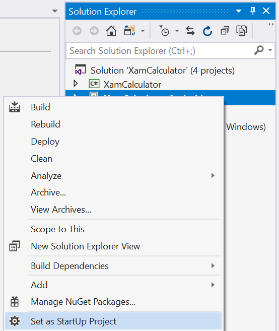

2. Make sure that an emulator is selected in the Run dropdown.

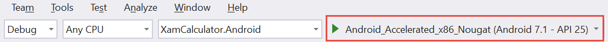

3. Press the Run button to debug the code.

4. In the emulator window, enter two operands and press the Add button. After a short wait, you should see the result.

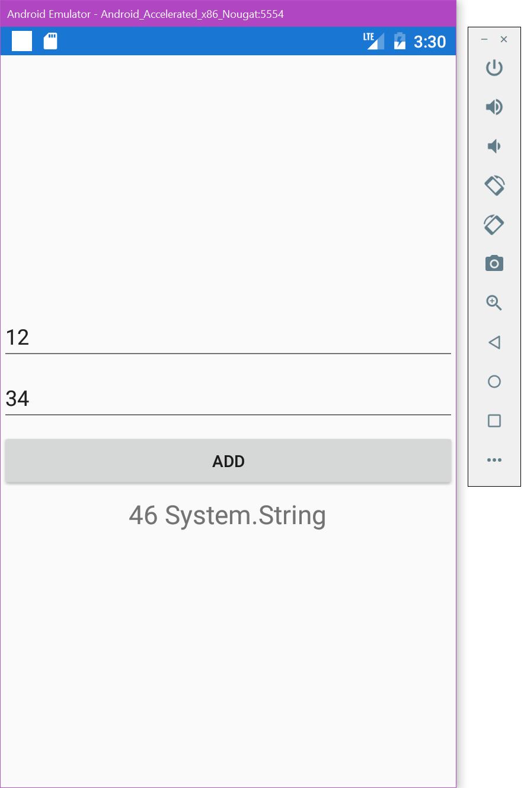

### On iOS

On iOS you can run the app in the iOS simulator to test it.

1. Right-click on the iOS application and select "Set as Startup Project".

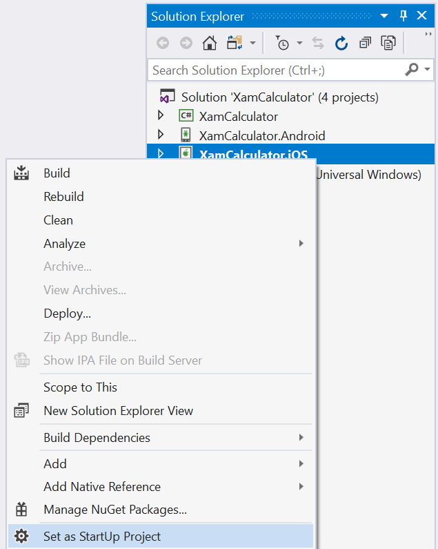

2. Make sure that "iPhoneSimulator" and a simulator are selected in the toolbar.

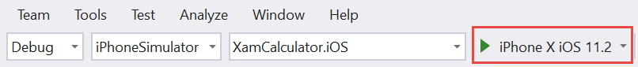

3. Press the Run button to debug the code.

4. In the simulator window, enter two operands and press the Add button. After a short wait, you should see the result.

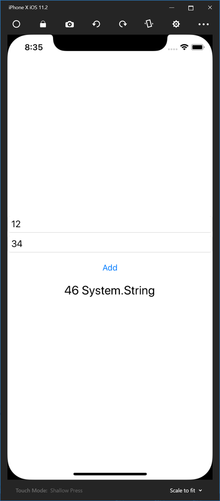

### On Windows (UWP)

To test on Windows 10, you can run the application on the local machine directly from Visual Studio 2017.

1. Right-click on the UWP application and select "Set as Startup Project".

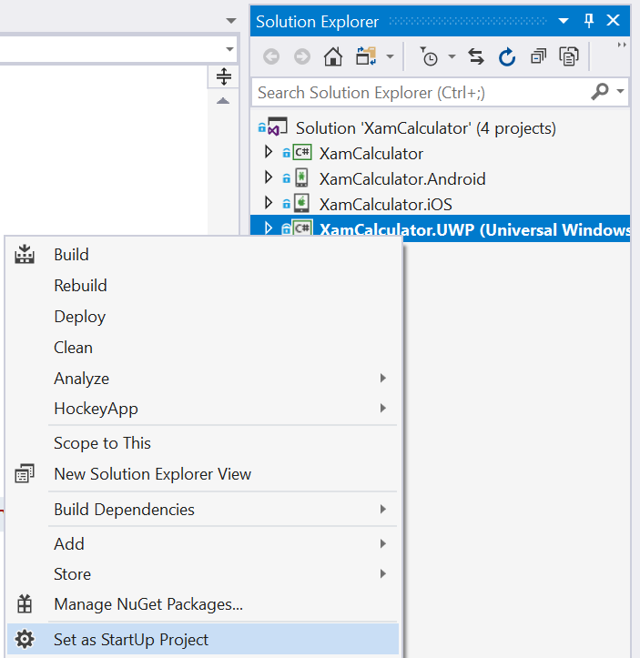

2. Make sure that x86 and Local Machine are selected in the toolbar.

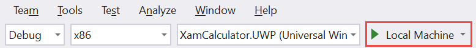

3. Press the Run button to debug the code.

4. In the window that opens up, enter two operands and press the Add button. After a short wait, you should see the result.

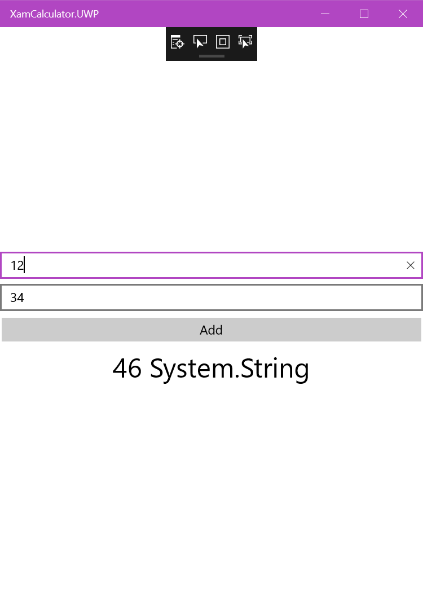

## Conclusion

We have now tested that the application works well. This concludes this sample. You can now easily modify this application to add features or change the way it works. We hope that you found this sample useful. Please don't hesitate to enter comments and questions in the Issues tab above. You can also contact me privately but I prefer to keep the discussion in the open, so everyone can see the answers. 

Happy coding!
Laurent